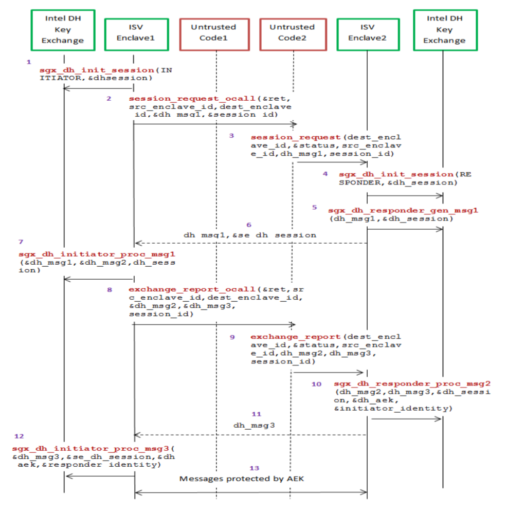

# TPDV

Tamper-Proof Digital Vault, or TPDV, is a proof of concept for a secure vault Linux application relying on Intel SGX enclaves. It is designed to have these operations on it available

## Introduction

Intel SGX offers an arbitrary number of secure enclaves which can be seen as special memory areas with special security features.

At a high level, when an enclave is instantiated it provides protection to the data by keeping it within the boundary of the enclave. Enclave developers should identify enclave data and/or state that is considered secret and potentially needs to be preserved across the following events during which the enclave is destroyed:

- The application is done with the enclave and closes it.
- The application itself is closed.
- The platform is hibernated or shutdown.

In general, the secrets provisioned to an enclave are lost when the enclave is closed. But if the secret data needs to be preserved during one of these events for future use within an enclave, then it must be stored outside the enclave boundary before closing the enclave. In order to protect and preserve the data, a mechanism is in place which allows enclave software to retrieve a key unique to that enclave. This key can only be generated by that enclave on that particular platform. Enclave software uses that key to encrypt data to the platform or to decrypt data already on the platform. SGX refer to these encrypt and decrypt operations as sealing and unsealing, respectively.

## Secure Vault Architecture

First and foremost, we set some boundaries for our security architecture. We consider it noteworthy that SGX's security model does not include secrecy of the code on the host Linux system. Any user on the host Linux system is free to inspect the executable files, as per the ACL and MAC policies of the system of course. With that in mind we relax the preconditions of our security model, and we choose not to spend too much effort in practices against reverse engineering or debugging, of either the application or the enclave software. However, as an illustration of some potential anti-reversing techniques, it could be said that pushing more code inside the enclave perimeter will make dynamic analysis of software more difficult. Indeed there are significant memory safety guarantees that are interesting for critical code paths such as changing the password or adding entries to the vault.

Once an SGX enclave is started, the software running in it can be said to be running with interesting isolation properties.

Most critically, it is imperative that the vault file is protected when the data is at rest (not in memory during program execution) which is the textbook use case for Intel SGX. We seal the file when saving from memory to disk, and unseal it when loading from disk to memory. The semantics of sealing ensure that only a given version of the enclave is allowed to process the vault data. It will not be possible to process the vault file outside of the enclave (not even firmware) because the associated key for the encryption and signing is unique to the enclave's lifecycle.

We specify a Diffie-Hellman Key Exchange routine for obtaining a shared key secret with other enclaves. We use AES-GCM encryption with said 128 bit key to secure communication channels between enclaves. This allows the secure implementation of an enclave upgrade or clone feature.

In brief, our architecture stands on top of three important pillars supported by Intel SGX APIs which we will detail more of:

- Isolation
- Sealing
- Diffie-Hellman Key Exchange
- Encryption

### Isolation

In order of contribution to our security model, we push to the enclave perimeter the following routines:

1. Data at rest sealing
2. Enclave upgrade  or clone
3. Vault password change
4. Add entry to vault

### Sealing: `sgx_seal_data`, `sgx_unseal_data`

Cryptographically sign and asymetrically encrypt data at rest, in such a way that only the signer (the enclave) can decrypt it back thus limiting the access to the vault to the enclave.

### Diffie-Hellman Key Exchange: `sgx_dh`

To upgrade enclave software or 

### Encryption: `sgx_rijndael128GCM_encrypt`, `sgx_rijndael128GCM_decrypt`

For encryption we considered Rijndael AES-GCM

```
/**Rijndael AES-GCM - Only 128-bit key AES-GCM Encryption/Decryption is supported
*
* The Galois/Counter Mode (GCM) is a mode of operation of the AES algorithm.
* GCM [NIST SP 800-38D] uses a variation of the Counter mode of operation for encryption.
* GCM assures authenticity of the confidential data (of up to about 64 GB per invocation)
* using a universal hash function defined over a binary finite field (the Galois field).
*
* GCM can also provide authentication assurance for additional data
* (of practically unlimited length per invocation) that is not encrypted.
* GCM provides stronger authentication assurance than a (non-cryptographic) checksum or
* error detecting code. In particular, GCM can detect both accidental modifications of
* the data and intentional, unauthorized modifications.
*
* sgx_rijndael128GCM_encrypt:
* Return: If key, source, destination, MAC, or IV pointer is NULL, SGX_ERROR_INVALID_PARAMETER is returned.
*         If AAD size is > 0 and the AAD pointer is NULL, SGX_ERROR_INVALID_PARAMETER is returned.
*         If the Source Length is < 1, SGX_ERROR_INVALID_PARAMETER is returned.
*         IV Length must = 12 (bytes) or SGX_ERROR_INVALID_PARAMETER is returned.
*         If out of enclave memory then SGX_ERROR_OUT_OF_MEMORY is returned.
*         If the encryption process fails then SGX_ERROR_UNEXPECTED is returned.
*
* sgx_rijndael128GCM_decrypt:
* Return: If key, source, destination, MAC, or IV pointer is NULL, SGX_ERROR_INVALID_PARAMETER is returned.
*         If AAD size is > 0 and the AAD pointer is NULL, SGX_ERROR_INVALID_PARAMETER is returned.
*         If the Source Length is < 1, SGX_ERROR_INVALID_PARAMETER is returned.
*         IV Length must = 12 (bytes) or SGX_ERROR_INVALID_PARAMETER is returned.
*         If the decryption process fails then SGX_ERROR_UNEXPECTED is returned.
*         If the input MAC does not match the calculated MAC, SGX_ERROR_MAC_MISMATCH is returned.
*
* Parameters:
*   Return: sgx_status_t  - SGX_SUCCESS or failure as defined in sgx_error.h
*   Inputs: sgx_aes_gcm_128bit_key_t *p_key - Pointer to the key used in encryption/decryption operation
*                                             Size MUST BE 128-bits
*           uint8_t *p_src - Pointer to the input stream to be encrypted/decrypted
*           uint32_t src_len - Length of the input stream to be encrypted/decrypted
*           uint8_t *p_iv - Pointer to the initialization vector
*           uint32_t iv_len - Length of the initialization vector - MUST BE 12 (bytes)
*                             NIST AES-GCM recommended IV size = 96 bits
*           uint8_t *p_aad - Pointer to the input stream of additional authentication data
*           uint32_t aad_len - Length of the additional authentication data stream
*           sgx_aes_gcm_128bit_tag_t *p_in_mac - Pointer to the expected MAC in decryption process
*   Output: uint8_t *p_dst - Pointer to the cipher text for encryption or clear text for decryption. Size of buffer should be >= src_len.
*           sgx_aes_gcm_128bit_tag_t *p_out_mac - Pointer to the MAC generated from encryption process
* NOTE: Wrapper is responsible for confirming decryption tag matches encryption tag
*/
sgx_status_t SGXAPI sgx_rijndael128GCM_encrypt(const sgx_aes_gcm_128bit_key_t *p_key,
                                            const uint8_t *p_src,
                                            uint32_t src_len,
                                            uint8_t *p_dst,
                                            const uint8_t *p_iv,
                                            uint32_t iv_len,
                                            const uint8_t *p_aad,
                                            uint32_t aad_len,
                                            sgx_aes_gcm_128bit_tag_t *p_out_mac);
sgx_status_t SGXAPI sgx_rijndael128GCM_decrypt(const sgx_aes_gcm_128bit_key_t *p_key,
                                            const uint8_t *p_src,
                                            uint32_t src_len,
                                            uint8_t *p_dst,
                                            const uint8_t *p_iv,
                                            uint32_t iv_len,
                                            const uint8_t *p_aad,
                                            uint32_t aad_len,
                                            const sgx_aes_gcm_128bit_tag_t *p_in_mac);
```

as well as a FIPS compatible version of AES-GCM Encryption

```
/** FIPS compatible version AES-GCM Encryption function, which will generate a random initialization vector
*
* sgx_aes_gcm_encrypt:
* Return: If key, source, destination, MAC, or IV pointer is NULL, SGX_ERROR_INVALID_PARAMETER is returned.
*         If AAD size is > 0 and the AAD pointer is NULL, SGX_ERROR_INVALID_PARAMETER is returned.
*         If the Source Length is < 1, SGX_ERROR_INVALID_PARAMETER is returned.
*         IV Length must = 12 (bytes) or SGX_ERROR_INVALID_PARAMETER is returned.
*         If out of enclave memory, then SGX_ERROR_OUT_OF_MEMORY is returned.
*         If the encryption process fails then SGX_ERROR_UNEXPECTED is returned.
* Parameters:
*   Return: sgx_status_t - SGX_SUCCESS or failure as defined in sgx_error.h
*   Inputs: uint8_t *p_key - Pointer to the key used in encryption operation
*                            Size must be 16 bytes (128-bits) or 32 bytes (256-bits)
*           uint32_t key_len – Key size, must be 16 (bytes) or 32 (bytes)
*           uint8_t *p_src - Pointer to the input stream to be encrypted
*           uint32_t src_len - Length of the input stream to be encrypted
*           uint32_t iv_len - Length of the initialization vector - MUST BE 12 (bytes)
*                             NIST AES-GCM recommended IV size = 96 bits
*           uint8_t *p_aad - Pointer to the input stream of additional authentication data
*           uint32_t aad_len - Length of the additional authentication data stream
*   Output: uint8_t *p_dst - Pointer to the cipher text. Size of buffer should be >= src_len
*           sgx_aes_gcm_128bit_tag_t *p_out_mac - Pointer to the MAC generated from encryption process
*           uint8_t *p_iv - Pointer to the generated initialization vector. Size of buffer should be >= iv_len
*/
sgx_status_t sgx_aes_gcm_encrypt(const uint8_t *p_key,
                                uint32_t key_len,
                                const uint8_t *p_src,
                                uint32_t src_len,
                                uint8_t *p_dst,
                                uint8_t *p_iv,
                                uint32_t iv_len,
                                const uint8_t *p_aad,
                                uint32_t aad_len,
                                sgx_aes_gcm_128bit_tag_t *p_out_mac);

/** AES-GCM Decryption
*
* sgx_aes_gcm_decrypt:
* Return: If key, source, destination, MAC, or IV pointer is NULL, SGX_ERROR_INVALID_PARAMETER is returned.
*         If AAD size is > 0 and the AAD pointer is NULL, SGX_ERROR_INVALID_PARAMETER is returned.
*         If the Source Length is < 1, SGX_ERROR_INVALID_PARAMETER is returned.
*         IV Length must = 12 (bytes) or SGX_ERROR_INVALID_PARAMETER is returned.
*         If out of enclave memory, then SGX_ERROR_OUT_OF_MEMORY is returned.
*         If the decryption process fails then SGX_ERROR_UNEXPECTED is returned.
* Parameters:
*   Return: sgx_status_t - SGX_SUCCESS or failure as defined in sgx_error.h
*   Inputs: uint8_t *p_key - Pointer to the key used in decryption operation
*                            Size must be 16 bytes (128-bits) or 32 bytes (256-bits)
*           uint32_t key_len – Key size, must be 16 (bytes) or 32 (bytes)
*           uint8_t *p_src - Pointer to the input stream to be decrypted
*           uint32_t src_len - Length of the input stream to be decrypted
*           uint8_t *p_iv - Pointer to the initialization vector
*           uint32_t iv_len - Length of the initialization vector - MUST BE 12 (bytes)
*                             NIST AES-GCM recommended IV size = 96 bits
*           uint8_t *p_aad - Pointer to the input stream of additional authentication data
*           uint32_t aad_len - Length of the additional authentication data stream
*           sgx_aes_gcm_128bit_tag_t *p_in_mac - Pointer to the expected MAC in decryption process
*   Output: uint8_t *p_dst - Pointer to the clear text for decryption. Size of buffer should be >= src_len
* NOTE: Wrapper is responsible for confirming decryption tag matches encryption tag
*/
sgx_status_t sgx_aes_gcm_decrypt(const uint8_t *p_key,
                                uint32_t key_len,
                                const uint8_t *p_src,
                                uint32_t src_len,
                                uint8_t *p_dst,
                                const uint8_t *p_iv,
                                uint32_t iv_len,
                                const uint8_t *p_aad,
                                uint32_t aad_len,
                                const sgx_aes_gcm_128bit_tag_t *p_in_mac);
```

## Implementation

In this section we discuss, for each specified feature, our engineering decisions and how they can be used through a simple CLI.

### Create Vault

Lorem ipsum

### Add Entry to Vault

Lorem ipsum

### List Entries in Vault

Lorem ipsum

### Get Entry in Vault

Lorem ipsum

### Compare Entry Digest in Vault

Lorem ipsum

### Password Change in Vault

Lorem ipsum

### Clone Vault

Obviously a file sealed by some Enclave1 cannot be accessed by another Enclave2, by definition of what sealing is.  The special feature called the vault clone allows a vault file originally sealed by Enclave1, to be imported to a new enclave Enclave2 which in turn now seals the data.

This is a delicate security engineering task because the two enclaves will have to communicate in order to exchange the contents of the vault. This exchange must be secure, i.e. the vault contents can only be known to Enclave1 and Enclave2. We designed our communication channel to be symmetrically encrypted with AES-GCM using a 128 bit shared key obtained through a Diffie-Hellman key exchange. In this way the contents can be communicated securely because only Enclave1 and Enclave2 will know the key.

This feature was developed as a proof of concept with a few simplifications that allow us to focus on the core study of SGX APIs. For this proof of concept, Enclave1 and Enclave2:

- are both running locally on the same host
- communicate over the Linux filesystem of their host by writing and reading files, protected by standard symmetric encryption
- are identical, except for a version string which exemplifies how to spin off new vault file versions

Under these simplifications this can be considered a case of Local Attestation (rather than Remote Attestation). In practical terms, this could be seen as an upgrade feature that allows upgrading a vault file to be compatible with the latest version of the enclave software.

To securely clone **vault1** (originated from Enclave1) to a new **vault2** (originated by Enclave2) we take the following steps:

1. Through a Diffie-Hellman key exchange, arrive at a shared key secret for secure communication between Enclave1 and Enclave2.
2. Unseal **vault1** through Enclave1 and keep it in host application memory.
3. Encrypt **vault1** with the shared key secret and keep it in host application memory.
4. Send encrypted **vault1** over the communication channel (in this case write a file to the host Linux filesystem).
5. Decrypt **vault1** through Enclave2 and keep it in host application memory.
6. Seal **vault2** through Enclave2 and write it to the new location.

The Diffie-Hellman key exchange is as follows:

1. Enclave 1 initiates DH session: `sgx_dh_init_session(SGX_DH_SESSION_INITIATOR,&dh_session)`
2. Enclave 2 initiates DH session: `sgx_dh_init_session(SGX_DH_SESSION_RESPONDER,&dh_session)`
3. Enclave 2 creates msg1: `sgx_dh_responder_gen_msg1(sgx_dh_msg1_t *msg1,sgx_dh_session_t *dh_session)`
4. App sends msg1 from Enclave2 to Enclave1
5. Enclave 1 processes msg1: `sgx_dh_initiator_proc_msg1(const sgx_dh_msg1_t *msg1,sgx_dh_msg2_t *msg2,sgx_dh_session_t *dh_session)`
6. App send msg2 from enclave1 to enclave2
7. Enclave 2 processes msg2: `sgx_dh_responder_proc_msg2(const sgx_dh_msg2_t *msg2,sgx_dh_msg3_t *msg3,sgx_dh_session_t *dh_session,sgx_key_128bit_t *aek,sgx_dh_session_enclave_identity_t *initiator_identity)`
8. App sends msg3 from Enclave2 to Enclave1
9. Enclave 1 processes msg3: `sgx_dh_initiator_proc_msg3(const sgx_dh_msg3_t *msg3,sgx_dh_session_t *dh_session,sgx_key_128bit_t *aek,sgx_dh_session_enclave_identity_t *responder_identity)`



## Criticism

In the future TPDV can be improved as follows:

- Remote attestation to ensure the software operating on the secret vault is a software version known to the manufacturer. Failing that, the vault application software refuses to start.
- Push more routines to the enclave boundary. Depending

## Conclusion

Lorem ipsum
